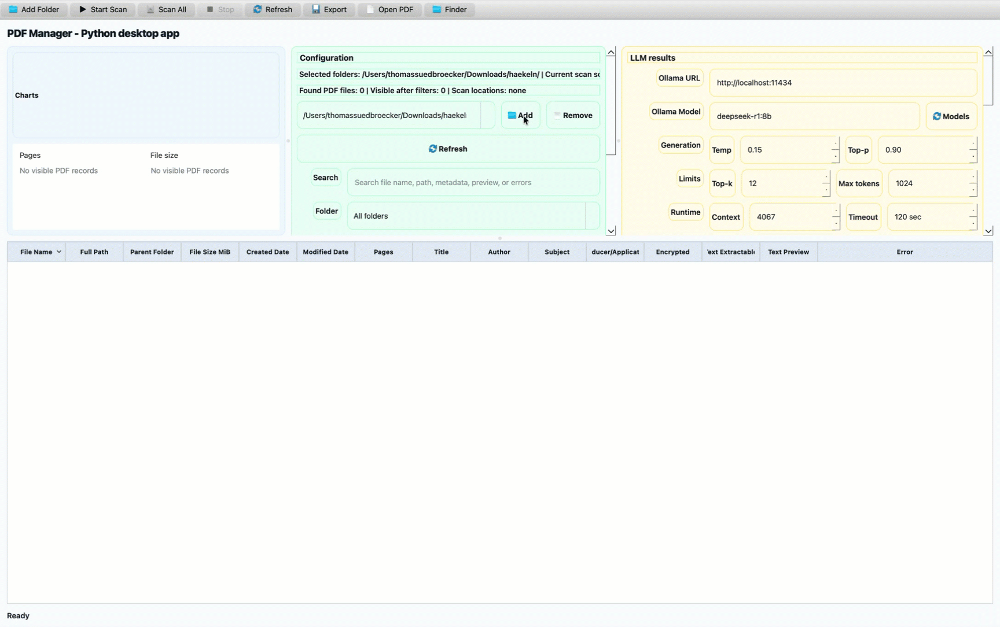
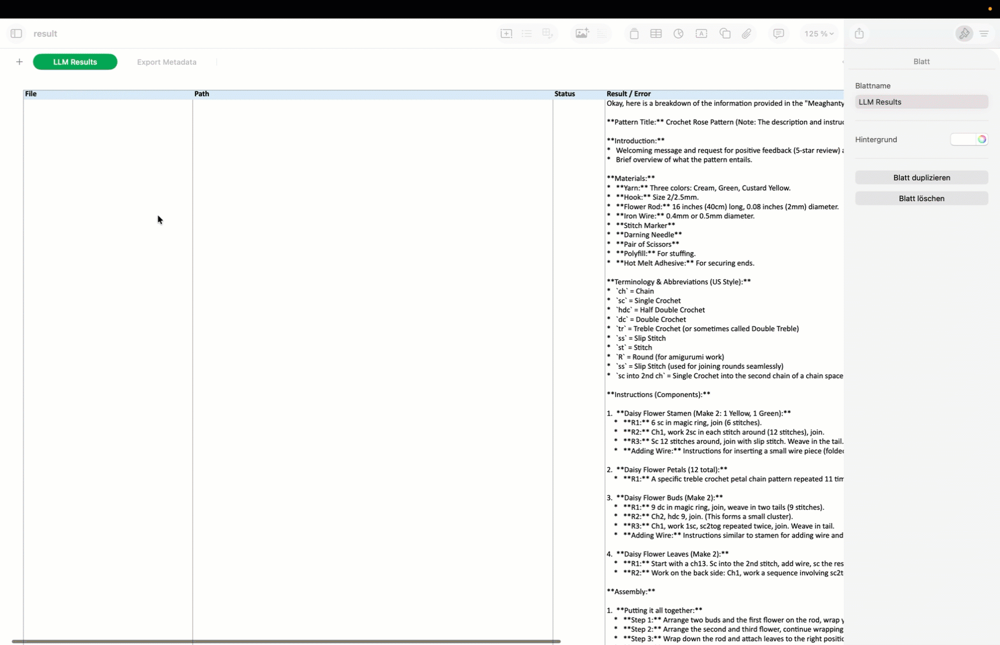
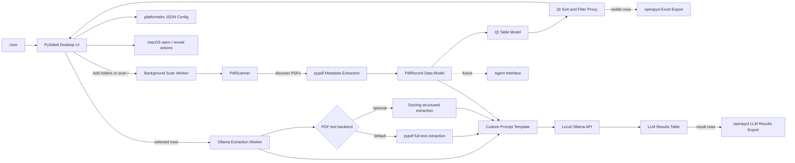
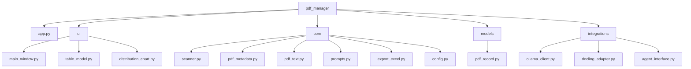
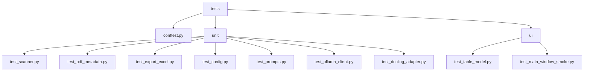
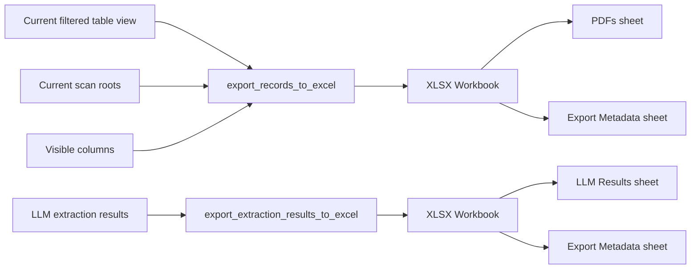

# PDF Manager

Local-first macOS desktop application for finding PDF files, inspecting PDF metadata, filtering the result set, and exporting the visible table to Excel.

The application runs fully offline. It does not use cloud services, proprietary APIs, or paid services. Optional Ollama extraction talks only to a user-provided local Ollama server. Optional Docling PDF text extraction is available when Docling is installed separately.

* Add folders



* LLM usage 


* Export result file




## Objective

Provide a simple desktop tool for building an inventory of PDFs on a Mac.

The first version focuses on:

- scanning selected folders or the entire local filesystem from `/`
- extracting lightweight PDF metadata
- handling unreadable, corrupt, encrypted, and protected files without crashing
- filtering and sorting PDF records in a desktop table
- exporting the current filtered table to `.xlsx`
- running custom local extraction prompts against selected PDFs through Ollama, using either fast `pypdf` text extraction or optional slower Docling extraction
- keeping the architecture ready for later Docling and agent-based inspection

## What You Can Run

### Desktop application

```bash
python -m pdf_manager.app
```

Or, after editable installation:

```bash
pdf-manager
```

### Generate a macOS app bundle

Create a clickable macOS launcher app inside this repository:

```bash
.venv/bin/python scripts/build_macos_app.py
```

The generated bundle is written to:

```text
mac_app/PDF Manager.app
```

This app bundle launches the repository code with `.venv/bin/python` when the virtual environment exists, and falls back to `python3` on `PATH`. It is a repo-local launcher, not a standalone signed installer.

### Optional local Ollama API check

The custom extraction panel uses a local Ollama API endpoint. If Ollama is running on the default port, this should return local model metadata:

```bash
curl http://localhost:11434/api/tags
```

### Tests

```bash
pytest
pytest tests/unit -m unit
pytest tests/ui -m ui
pytest -m "not ui"
```

## Why This Project Is Useful

- It gives a local PDF inventory without sending files to external services.
- It can scan one folder, multiple manually added folders, or the whole machine.
- It shows the number of found PDF files, the number currently visible after filters, and the active scan locations in the UI.
- It keeps the PDF list as the primary result view and adds distribution charts above the list.
- It keeps bad PDF files visible through per-record errors instead of failing the scan.
- It exports the same filtered table view the user is looking at.
- It separates UI code from scanning, metadata extraction, config, and export logic.
- It supports custom local extraction prompts with Ollama without adding a required Python dependency.
- It can optionally use Docling for slower structured PDF text extraction when Docling is installed separately.
- It includes an optional Docling extraction backend and a placeholder boundary for future agent-based document-processing features.

## Architecture At A Glance

### Runtime Flow



The scanner and metadata code are independent of the UI. This keeps the first version testable and allows later workflows to reuse `PdfRecord` objects without rewriting the desktop table or Excel export.

### Package Structure



### Test Structure



### Export Workbook Structure



## Start Here

### 1. Create a virtual environment

```bash
cd /path/to/pdf_extraction_mac
python3.12 -m venv .venv
source .venv/bin/activate
python -m pip install --upgrade pip
```

### 2. Install the project

```bash
python -m pip install -e ".[test]"
```

### 3. Run the app

```bash
python -m pdf_manager.app
```

If you see `ModuleNotFoundError: No module named 'pdf_manager'`, run the command from the repository root or activate the virtual environment where the editable install was executed.

### 4. Optional: generate the macOS app launcher

```bash
.venv/bin/python scripts/build_macos_app.py
open "mac_app/PDF Manager.app"
```

The generated `PDF Manager.app` stays under `mac_app/` in the repository. To write the bundle somewhere else, pass `--output-dir /path/to/output`.

### 5. Optional: use local Ollama extraction

Start Ollama and make sure at least one local model is available:

```bash
ollama list
curl http://localhost:11434/api/tags
```

In the app:

1. Scan PDFs.
2. Select one or more rows in the PDF table.
3. Enter the Ollama URL, usually `http://localhost:11434`.
4. Enter a local model name, for example `llama3.1:8b`.
5. Adjust optional generation settings if needed.
6. Edit the extraction prompt.
7. Select `Run Selected`.

To use the optional Docling PDF text backend, install the optional extra first from the repository root:

```bash
python -m pip install -e ".[docling,test]"
```

If the project is already installed and you only want the runtime Docling extra, use:

```bash
python -m pip install -e ".[docling]"
```

After installation, restart the app. In the `PDF text` row, select `Docling slower`. The app shows whether Docling is installed; if it is missing, it displays the install command in the LLM section and returns a per-file extraction error instead of crashing.

## Main Components

| Area | Files | Responsibility |
|---|---|---|
| App entry point | `pdf_manager/app.py` | Starts the PySide6 application. |
| UI | `pdf_manager/ui/main_window.py`, `pdf_manager/ui/table_model.py` | Desktop window, table, filtering, background scan wiring, open/reveal actions, custom prompt controls. |
| macOS app launcher | `scripts/build_macos_app.py` | Generates `mac_app/PDF Manager.app` inside the repository. |
| Charts | `pdf_manager/ui/distribution_chart.py` | Page-count and file-size distribution histograms for visible PDF records. |
| Scanner | `pdf_manager/core/scanner.py` | Recursively finds PDFs, including whole-machine scans from `/`, while skipping inaccessible folders. |
| Metadata | `pdf_manager/core/pdf_metadata.py` | Extracts file and PDF metadata with `pypdf`. |
| Text extraction | `pdf_manager/core/pdf_text.py` | Extracts capped PDF text for local prompt workflows. |
| Prompt rendering | `pdf_manager/core/prompts.py` | Stores and renders custom prompt templates with PDF fields and extracted text. |
| Export | `pdf_manager/core/export_excel.py` | Exports visible records to `.xlsx` with metadata sheet. |
| Config/log paths | `pdf_manager/core/config.py` | Stores local JSON config and log paths using `platformdirs`. |
| Data model | `pdf_manager/models/pdf_record.py` | UI-independent typed PDF record. |
| Local integrations | `pdf_manager/integrations/ollama_client.py` | Optional local Ollama API client. |
| Optional Docling adapter | `pdf_manager/integrations/docling_adapter.py` | Uses Docling for structured PDF text extraction when the optional dependency is installed. |
| Future integrations | `pdf_manager/integrations/` | Placeholder interfaces for agent workflows. |
| Tests | `tests/unit/`, `tests/ui/` | Separated unit and UI-related pytest suites. |

## Current Application Behavior

The main window identifies the app as `PDF Manager - Python desktop app`.

### Scan Scope

The app supports two scan modes:

- `Start Scan`: scans folders added with the `Add Folder` button.
- `Scan All`: scans from `/`.

The configuration panel includes a selected-folder dropdown with `Add` and `Remove` buttons. Use `Add` to append another scan folder and `Remove` to remove the currently selected folder from future `Start Scan` runs.

Whole-machine scans can take a long time. macOS privacy controls can deny access to protected locations. The scanner skips inaccessible folders, logs the technical detail, and continues scanning the rest of the filesystem. During discovery, the status bar shows the directory currently being searched.

The UI keeps a scan summary visible above the table:

- found PDF file count
- visible PDF count after active filters
- current scan locations

The UI also shows two distribution charts above the table:

- page-count distribution for visible PDF records
- file-size distribution for visible PDF records

The table/list remains the primary detailed result view. Charts are additive and update with the same filtered records as the table.

### PDF Metadata Collected

For each PDF, the app records:

- file name
- full path
- parent folder
- file size
- created date
- modified date
- page count
- title
- author
- subject
- producer/application metadata
- encrypted state
- text-extractable state
- short first-page text preview when safely extractable
- per-file error message when extraction fails

### Table and Export

The UI table supports sorting and filtering by:

- search text
- folder
- page count range
- file size range
- encrypted or not encrypted
- text extractable or not extractable

The `Export` action exports the current visible table result to `.xlsx`, not necessarily the full scan result. The workbook includes a `PDFs` sheet and an `Export Metadata` sheet with the export timestamp, scan roots, and visible columns.

### Custom Local Ollama Extraction

The UI includes a local extraction section for selected PDF rows:

- `Ollama URL`: local Ollama base URL, default `http://localhost:11434`
- `Ollama Model`: local model name, for example `llama3.1:8b`
- `Generation`: temperature and top-p controls
- `Limits`: top-k and max token controls
- `Runtime`: context window and request timeout controls
- `PDF text`: choose fast `pypdf` extraction or slower Docling structured extraction
- `Extraction prompt`: editable custom prompt template
- `Prompt inputs`: always shows the variables users should keep available while editing the prompt
- `Save`: saves prompt and Ollama settings
- `Reset`: restores the prompt editor to the default extraction template
- `Clear Results`: clears the model result table, latest extracted PDF, elapsed time, progress text, and last settings
- `Export Results`: exports the model result rows to an `.xlsx` workbook
- `Stop`: cancels a running local Ollama extraction request
- `Run Selected`: extracts PDF text for selected rows, renders the prompt once per file, and sends each file prompt to local Ollama
- `Last settings`: shows the model and generation parameters used for the latest run
- `Extracted PDF`: keeps the latest available PDF from the result list visible with an `Open latest PDF` button
- `Extraction result`: read-only table with one row per related file and columns for file, path, status, result/error, and an `Open` action

During local AI extraction, the status bar and extraction progress label show live progress such as `Ollama extraction running: 2/5 - report.pdf`. This is intended to make long-running local model calls visibly active instead of looking like the desktop app has stalled.

Selecting Docling shows a warning in the UI because Docling performs structured document conversion and can take significantly more time per PDF. If Docling is selected but not installed, the result table shows a per-file error instead of failing the whole app.

The table supports multi-row selection for this prompt workflow. `Open PDF` and `Finder` operate on the first selected row in the main PDF table. Generated extraction result rows also include an `Open` button, and double-clicking a result row opens that PDF. After results are generated, the result list selects and scrolls to the latest available PDF row, and the `Extracted PDF` row keeps that PDF available through `Open latest PDF`. Use `Export Results` to write the current LLM result rows to Excel.

Prompt templates can use these inputs:

| Input | Source | Meaning |
|---|---|---|
| `{text}` | PDF extraction | Extracted PDF text sent to Ollama. |
| `{documents}` | PDF extraction | Compatibility alias for `{text}`. |
| `{file_name}` | PDF metadata | Current PDF file name. |
| `{full_path}` | PDF metadata | Current PDF full path. |
| `{page_count}` | PDF metadata | Current PDF page count, when available. |
| `{title}` | PDF metadata | PDF title metadata, when available. |
| `{author}` | PDF metadata | PDF author metadata, when available. |
| `{subject}` | PDF metadata | PDF subject metadata, when available. |
| `{producer}` | PDF metadata | PDF producer/application metadata, when available. |
| `{file_count}` | Runtime | `1` for each per-file Ollama prompt call. |

Ollama is called separately for each selected PDF, so file placeholders such as `{file_name}`, `{full_path}`, and `{page_count}` refer to the current file being processed. `{text}` contains the current file's extracted text. `{documents}` is kept as a compatibility alias for `{text}`, and `{file_count}` is `1` for each per-file prompt call. While editing the prompt, the app shows whether `{text}` or `{documents}` is present. If a custom prompt does not include either one, the app appends a `PDF text:` block automatically so Ollama still receives the extracted PDF text.

The default prompt asks for a concise structured extraction with title/topic, summary, key entities, dates or amounts, action items or decisions, and uncertainty notes for each selected file. The displayed result is a table of file/result rows. Custom prompts are stored locally.

Ollama is optional. Normal scanning, filtering, charts, and Excel export work without Ollama installed or running.

### Local Files

Runtime settings are stored in a local JSON config file under the path returned by:

```python
platformdirs.user_config_dir("PDF Manager", "Local PDF Tools")
```

Technical logs are written under:

```python
platformdirs.user_log_dir("PDF Manager", "Local PDF Tools")
```

The app does not write scan results automatically. Excel files are only created when the user explicitly exports.

The custom Ollama URL, model name, generation parameters, request timeout, PDF text extraction backend, and extraction prompt are stored in the same local JSON config file as the other user settings.

## Current Verified State

Latest local verification in this workspace:

| Command | Result |
|---|---|
| `.venv/bin/python -m pytest tests/unit -m unit -q` | `26 passed` |
| `.venv/bin/python -m pytest tests/ui -m ui -q` | `20 passed` |
| `.venv/bin/python -m pytest -q` | `46 passed` |

Known warning:

- `QSortFilterProxyModel.invalidateFilter()` is deprecated in the installed Qt version. It does not currently fail tests.

## Test Status Overview

The test setup separates fast non-UI unit tests from UI-related tests.

### Unit Tests

Unit tests validate core logic and do not launch the desktop UI.

| Test case | File | Reason |
|---|---|---|
| `test_scanner_finds_pdf_files_recursively` | `tests/unit/test_scanner.py` | Verifies nested PDF discovery. |
| `test_scanner_ignores_non_pdf_files` | `tests/unit/test_scanner.py` | Ensures unrelated files are ignored. |
| `test_scanner_handles_empty_folder` | `tests/unit/test_scanner.py` | Ensures empty folders return an empty result. |
| `test_scanner_handles_permission_or_missing_folder_gracefully` | `tests/unit/test_scanner.py` | Ensures invalid roots do not crash scanning. |
| `test_scanner_finds_uppercase_pdf_extensions` | `tests/unit/test_scanner.py` | Ensures `.PDF` files are discovered. |
| `test_scanner_continues_when_directory_walk_reports_error` | `tests/unit/test_scanner.py` | Ensures permission-style traversal errors do not stop discovery. |
| `test_pdf_metadata_extracts_basic_fields` | `tests/unit/test_pdf_metadata.py` | Verifies file and PDF metadata extraction. |
| `test_pdf_metadata_detects_invalid_pdf` | `tests/unit/test_pdf_metadata.py` | Ensures invalid PDFs produce an error field. |
| `test_pdf_metadata_detects_encrypted_pdf_if_supported` | `tests/unit/test_pdf_metadata.py` | Verifies encrypted PDF detection. |
| `test_pdf_metadata_extracts_text_preview_when_available` | `tests/unit/test_pdf_metadata.py` | Ensures first-page text preview works for text PDFs. |
| `test_export_excel_creates_xlsx_file` | `tests/unit/test_export_excel.py` | Verifies workbook creation. |
| `test_export_excel_contains_expected_headers` | `tests/unit/test_export_excel.py` | Verifies documented export headers. |
| `test_export_excel_exports_filtered_records_only` | `tests/unit/test_export_excel.py` | Ensures export receives the visible record set. |
| `test_export_excel_adds_metadata_sheet` | `tests/unit/test_export_excel.py` | Verifies export metadata sheet. |
| `test_export_extraction_results_to_excel_creates_llm_results_sheet` | `tests/unit/test_export_excel.py` | Verifies LLM result rows export to an Excel workbook. |
| `test_config_saves_and_loads_user_settings` | `tests/unit/test_config.py` | Verifies local settings persistence. |
| `test_config_uses_platformdirs_application_path` | `tests/unit/test_config.py` | Verifies app-support config path behavior. |
| `test_config_handles_missing_config_file` | `tests/unit/test_config.py` | Verifies default config startup. |
| `test_render_prompt_inserts_pdf_fields_and_text` | `tests/unit/test_prompts.py` | Verifies custom prompt rendering with PDF fields and extracted text. |
| `test_render_multi_prompt_inserts_file_count_and_documents` | `tests/unit/test_prompts.py` | Verifies multi-PDF prompt rendering with file count, document blocks, and the `{text}` compatibility alias. |
| `test_format_extraction_result_item_includes_file_and_result` | `tests/unit/test_prompts.py` | Verifies per-file extraction output includes the related file and result status. |
| `test_ollama_client_lists_local_models` | `tests/unit/test_ollama_client.py` | Verifies local model list parsing without requiring a live Ollama server. |
| `test_ollama_client_generates_with_streaming_disabled` | `tests/unit/test_ollama_client.py` | Verifies the local Ollama generate request body. |
| `test_ollama_client_generates_with_options` | `tests/unit/test_ollama_client.py` | Verifies configurable Ollama generation options are sent in the request body. |
| `test_docling_adapter_extracts_markdown_when_docling_is_available` | `tests/unit/test_docling_adapter.py` | Verifies the optional Docling adapter can extract Markdown-style text through a Docling-compatible converter. |
| `test_docling_adapter_reports_missing_docling` | `tests/unit/test_docling_adapter.py` | Verifies missing optional Docling dependency produces a clear runtime error. |

### UI Tests

UI tests validate table model behavior and basic window wiring. They mock Finder/PDF open calls and do not require manual interaction.

| Test case | File | Reason |
|---|---|---|
| `test_table_model_exposes_pdf_records` | `tests/ui/test_table_model.py` | Verifies `PdfRecord` to table row/column mapping. |
| `test_table_model_sorts_records_by_column` | `tests/ui/test_table_model.py` | Verifies sorting behavior through the filter proxy. |
| `test_table_model_filters_records` | `tests/ui/test_table_model.py` | Verifies search/filter behavior independent of the visible UI. |
| `test_distribution_chart_builds_page_and_size_bins` | `tests/ui/test_table_model.py` | Verifies page-count and file-size histogram buckets. |
| `test_main_window_can_be_created` | `tests/ui/test_main_window_smoke.py` | Verifies main window construction. |
| `test_main_window_warns_when_prompt_text_variable_is_missing` | `tests/ui/test_main_window_smoke.py` | Verifies prompt editing warns when `{text}` or `{documents}` is missing. |
| `test_main_window_can_start_entire_machine_scan_without_selected_folder` | `tests/ui/test_main_window_smoke.py` | Verifies whole-machine scan wiring from `/`. |
| `test_main_window_scan_summary_shows_found_files_and_locations` | `tests/ui/test_main_window_smoke.py` | Verifies count, location summary, and chart data updates. |
| `test_main_window_removes_selected_folder` | `tests/ui/test_main_window_smoke.py` | Verifies the selected folder can be removed and persisted. |
| `test_main_window_persists_custom_ollama_prompt_settings` | `tests/ui/test_main_window_smoke.py` | Verifies custom Ollama URL, model, generation parameters, timeout, and prompt settings are saved locally. |
| `test_main_window_resets_prompt_to_default` | `tests/ui/test_main_window_smoke.py` | Verifies the reset action restores the default extraction prompt. |
| `test_main_window_allows_more_than_ten_prompt_extraction_files` | `tests/ui/test_main_window_smoke.py` | Verifies multi-file prompt extraction can start with more than ten selected PDFs. |
| `test_main_window_shows_docling_extraction_warning` | `tests/ui/test_main_window_smoke.py` | Verifies selecting Docling shows the slower-extraction warning. |
| `test_main_window_shows_ollama_extraction_progress` | `tests/ui/test_main_window_smoke.py` | Verifies the UI displays active local AI extraction progress. |
| `test_main_window_shows_ollama_extraction_results_in_table` | `tests/ui/test_main_window_smoke.py` | Verifies local AI extraction results are displayed as file/result table rows. |
| `test_main_window_opens_pdf_from_extraction_results` | `tests/ui/test_main_window_smoke.py` | Verifies a generated result row can open its related PDF. |
| `test_main_window_opens_latest_extracted_pdf` | `tests/ui/test_main_window_smoke.py` | Verifies the latest extracted PDF shortcut opens the most recent result PDF. |
| `test_main_window_clears_model_extraction_results` | `tests/ui/test_main_window_smoke.py` | Verifies model result reset clears the result table and related status fields. |
| `test_main_window_exports_model_extraction_results` | `tests/ui/test_main_window_smoke.py` | Verifies the main window exports LLM result rows to Excel. |
| `test_ollama_worker_always_sends_extracted_text_to_model` | `tests/ui/test_main_window_smoke.py` | Verifies extracted PDF text is sent to Ollama even when a custom prompt omits `{text}`. |

## Fast Validation

Run the complete test suite:

```bash
.venv/bin/python -m pytest
```

Run only unit tests:

```bash
.venv/bin/python -m pytest tests/unit -m unit
```

Run only UI tests:

```bash
.venv/bin/python -m pytest tests/ui -m ui
```

Run all tests except UI tests:

```bash
.venv/bin/python -m pytest -m "not ui"
```

Run one test file:

```bash
.venv/bin/python -m pytest tests/unit/test_pdf_metadata.py
```

Run one specific test:

```bash
.venv/bin/python -m pytest tests/unit/test_pdf_metadata.py::test_pdf_metadata_extracts_basic_fields
```

## Open-Source Components

This application is designed to use only open-source components. The tables below list the direct runtime and development/test dependencies used by the project.

### Runtime Dependencies

| Component | Purpose in this project | License | Project link |
|---|---|---|---|
| Python | Application runtime | Python Software Foundation License Version 2 | https://www.python.org/ |
| PySide6-Essentials | Desktop UI framework through the `PySide6` Qt bindings namespace | LGPL-3.0-only OR GPL-2.0-only OR GPL-3.0-only | https://pypi.org/project/PySide6-Essentials/ |
| pypdf | PDF metadata, page count, encryption check, and text preview | BSD-3-Clause | https://pypdf.readthedocs.io/ |
| openpyxl | Excel `.xlsx` export | MIT License | https://openpyxl.readthedocs.io/ |
| platformdirs | Local configuration and log path handling | MIT | https://platformdirs.readthedocs.io/ |

License metadata for runtime dependencies was checked against the official Python documentation and selected package metadata pages:

- Python license: https://docs.python.org/3.12/license.html
- PySide6-Essentials package metadata: https://pypi.org/project/PySide6-Essentials/
- pypdf package metadata: https://pypi.org/project/pypdf/
- openpyxl package metadata: https://pypi.org/project/openpyxl/
- platformdirs package metadata: https://pypi.org/project/platformdirs/

### Development and Test Dependencies

| Component | Purpose in this project | License | Project link |
|---|---|---|---|
| pytest | Unit and UI test execution | MIT License | https://pytest.org/ |

License metadata for development and test dependencies was checked against official pytest documentation:

- pytest license: https://docs.pytest.org/en/stable/license.html

### Optional Local Services

The application can call a local Ollama server if the user has Ollama installed and running. Ollama is not installed by this Python project and is not listed in `pyproject.toml`.

| Component | Purpose in this project | Current status | License | Project link |
|---|---|---|---|---|
| Ollama local API | Optional local LLM extraction service for custom PDF prompts | Optional local service, accessed over HTTP | MIT | https://github.com/ollama/ollama |
| Docling | Optional structured PDF text extraction backend | Optional Python dependency, not installed by this project | Verify before use | https://www.docling.ai/ |

License metadata for optional local services was checked against the official repository:

- Ollama repository license: https://github.com/ollama/ollama

### Optional Future Components

These components are planned as future extension points and should only be treated as active dependencies if they are actually added to `pyproject.toml` and used by the application.

| Component | Planned purpose | Current status | License | Project link |
|---|---|---|---|---|
| Agent workflows | Agent-based inspection and document workflows | Placeholder only | Verify before use | Not selected |

> License information should be reviewed before redistribution or packaging. This README lists direct dependencies only and does not replace a full third-party license audit.

## Repository Layout

The same structure shown in the package diagram is represented on disk as:

```text
pdf_manager/
  app.py
  ui/
    main_window.py
    table_model.py
    distribution_chart.py
  core/
    scanner.py
    pdf_metadata.py
    pdf_text.py
    prompts.py
    export_excel.py
    config.py
  integrations/
    ollama_client.py
    docling_adapter.py
    agent_interface.py
  models/
    pdf_record.py
scripts/
  build_macos_app.py
mac_app/
  PDF Manager.app/
tests/
  conftest.py
  unit/
    test_config.py
    test_export_excel.py
    test_docling_adapter.py
    test_ollama_client.py
    test_pdf_metadata.py
    test_prompts.py
    test_scanner.py
  ui/
    test_main_window_smoke.py
    test_table_model.py
prompt/
  1_application_generation_prompt.md
  2_open_source_documentation.md
  3_define_test.md
  4_update_docu.md
  5_additional_changes.md
```

## Notes And Limitations

- Multi-folder selection is implemented by adding folders one at a time with the `Add Folder` button.
- Whole-machine scans start at `/`; macOS privacy controls can prevent access to protected folders unless the terminal or packaged app has the required permissions.
- The scanner skips inaccessible folders and continues scanning, but it cannot read data macOS does not allow the process to access.
- Visible column configuration is persisted, but the first UI version does not include a column chooser.
- Text preview is best-effort and limited to the first page.
- Ollama extraction is best-effort, local-only, and depends on the user running Ollama with a local model.
- Password-protected PDFs are detected but not decrypted unless an empty password works.
- Creation date uses filesystem metadata exposed by macOS/Python, not PDF-internal creation metadata.
- Docling extraction is optional and requires installing Docling separately; it can be slower than the default `pypdf` text extraction.
- Agent workflow execution is not implemented yet.
- Packaged macOS application testing and large-scale performance benchmarking are not covered yet.
